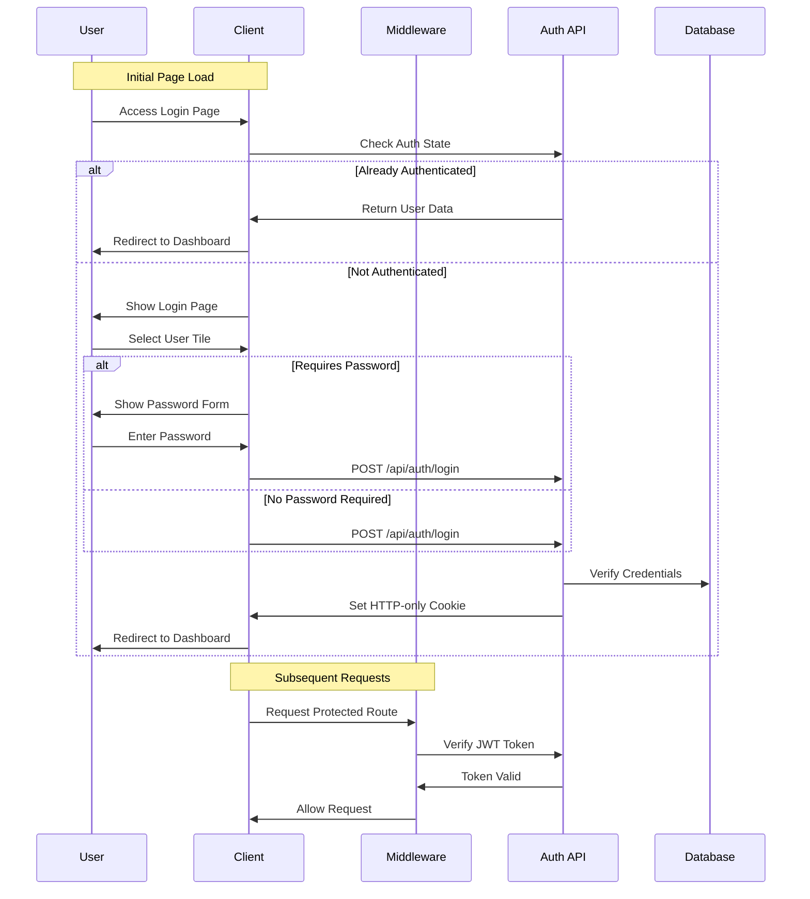

# Authentication & User Management Architecture

## System Design

### Component Architecture
```
/app/
├── auth/                     # Authentication components
│   ├── login/               # Login page components
│   │   ├── user-tile.tsx    # User selection tile
│   │   └── password-form.tsx # Password input form
│   └── middleware.ts        # Auth middleware
├── settings/                # User settings
│   ├── profile/            # Profile management
│   │   └── avatar.tsx      # Avatar upload component
│   └── password/           # Password management
└── api/                    # API routes
    ├── auth/               # Auth endpoints
    ├── settings/           # Settings endpoints
    └── upload/             # File upload endpoints
```

### Authentication Flow


### Data Models

```typescript
interface User {
  id: string;
  username: string;
  password_hash?: string;
  is_admin: boolean;
  avatar_url?: string;
  last_active_url?: string;
  requires_password: boolean;
  created_at: Date;
  updated_at: Date;
}

interface UserSettings {
  user_id: string;
  theme: 'light' | 'dark';
  menu_position: 'left' | 'top';
  created_at: Date;
  updated_at: Date;
}

interface Session {
  user_id: string;
  token: string;
  expires_at: Date;
  created_at: Date;
}
```

## Technical Decisions

### Authentication State Management
- Client-side auth state tracking
- Automatic redirects for authenticated users
- Loading state management
- Proper cleanup on logout

### JWT Authentication
- Chosen for stateless authentication
- Stored in HTTP-only cookies for security
- Short expiration with automatic refresh
- Includes user role and permissions

### Password Management
- Optional per-user passwords
- Argon2 hashing for security
- Secure password validation
- Password strength requirements

### File Upload
- Direct upload to local storage
- Image optimization on upload
- Secure file type validation
- Size and dimension limits

## Security Measures

### Authentication Security
- HTTP-only cookies
- CSRF protection
- Rate limiting
- Secure password hashing
- Input validation

### Session Management
- Short-lived JWT tokens
- Secure token storage
- Token refresh mechanism
- Session invalidation

### File Upload Security
- File type validation
- Size restrictions
- Malware scanning
- Secure storage

## Performance Considerations

### Authentication Optimization
- Minimal JWT payload
- Efficient token validation
- Caching user data
- Optimized database queries

### File Upload Optimization
- Image compression
- Chunked uploads
- Progressive loading
- Cache headers

## Dependencies

### Core Dependencies
```json
{
  "jsonwebtoken": "^9.0.0",
  "argon2": "^0.30.0",
  "cookie": "^0.5.0",
  "sharp": "^0.32.0"
}
```

### Development Tools
```json
{
  "@types/jsonwebtoken": "^9.0.0",
  "@types/cookie": "^0.5.0"
}
```

## Configuration Requirements

### Environment Variables
```env
JWT_SECRET=your-jwt-secret
JWT_EXPIRY=3600
COOKIE_NAME=auth_token
UPLOAD_DIR=./public/uploads
MAX_FILE_SIZE=5242880
```

### File Upload Configuration
```typescript
const uploadConfig = {
  maxSize: 5 * 1024 * 1024, // 5MB
  allowedTypes: ['image/jpeg', 'image/png'],
  dimensions: {
    max: { width: 1024, height: 1024 },
    avatar: { width: 128, height: 128 }
  }
};
```

## Initialization Process

1. Authentication Setup
   - Load JWT configuration
   - Initialize password hasher
   - Set up cookie options
   - Configure rate limiting

2. File Upload Setup
   - Create upload directories
   - Configure file limits
   - Initialize image processor
   - Set up cleanup jobs

3. Middleware Setup
   - Configure auth middleware
   - Set up CSRF protection
   - Initialize rate limiters
   - Configure error handlers 
