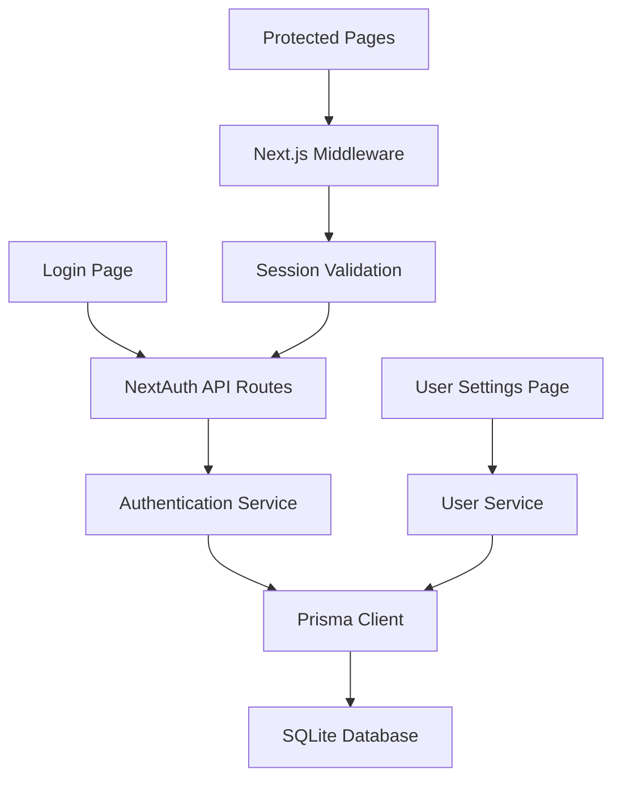

# Authentication Architecture

## System Design

### Overview

- The authentication system uses NextAuth.js for credential-based authentication
- JWT tokens stored in HTTP-only cookies provide secure session management
- Role-based access control protects routes and features
- User data and settings are stored in a SQLite database via Prisma ORM

### Component Relationships

### Data Flow

- Input handling: User credentials validated via Zod before processing
- Processing steps: 
  1. User enters credentials
  2. Credentials validated on client and server
  3. Password verified against hashed value
  4. JWT token generated with user data and preferences
  5. Token stored in HTTP-only cookie
- Error handling paths: 
  - Invalid credentials return appropriate error messages
  - Inactive users redirected to login with status message

## Technical Decisions

### Technology Choices

- NextAuth.js for authentication
  - Rationale: Provides secure, customizable auth with Next.js integration
  - Alternatives considered: Auth0, Clerk, custom implementation
- JWT for session management
  - Approach: HTTP-only cookies with configurable expiration
  - Justification: Secure, stateless, integrates well with Next.js
- bcryptjs for password hashing
  - Solution: Standard password hashing
  - Reasoning: Well-tested, secure implementation

### Design Patterns

- Service Layer
  - Use case: Separates authentication logic from API routes
  - Implementation details: `authService.js` in `/lib/services/`
- Provider Pattern
  - Use case: Session state management in React
  - Implementation details: NextAuth's `SessionProvider` wraps application

### Performance Considerations

- Caching strategy: User settings included in JWT to minimize database lookups
- Resource management: JWT size optimization by including only necessary data

## Dependencies

### External Services

- Service: NextAuth.js
  - Purpose: Authentication framework
  - API version: v4
  - Fallback strategy: Custom error pages for auth failures

### Internal Dependencies

- Module: Prisma ORM
  - Purpose: Database access for user data
  - Integration points: User and UserSetting models
  - Error handling: Prisma errors mapped to appropriate HTTP responses

### Configuration

- Environment variables:
  - `NEXTAUTH_SECRET`: Required for JWT encryption
  - `NEXTAUTH_URL`: Base URL for callbacks
  - `SESSION_DURATION_DAYS`: Configurable session length (default: 7)

## Security

### Authentication

- Method: Credential-based with JWT
- Implementation: NextAuth.js credential provider
- Token handling: HTTP-only cookies, server-side validation

### Authorization

- Access control: Role-based (ADMIN/USER)
- Role management: Stored in User model, included in JWT
- Permission checks: Next.js middleware for route protection

### Data Protection

- Encryption methods: Password hashing with bcryptjs
- Data handling: Sensitive data excluded from client-side session
- Privacy considerations: Minimal personal data collection

## Monitoring

### Metrics

- Key performance indicators: Login success rate, session duration
- Health checks: Auth service availability

### Logging

- Log levels: Error, warn, info
- Important events: Login attempts, password changes, first-run completion
- Error tracking: Auth failures logged to ActivityLog table

## Deployment

### Requirements

- Infrastructure needs: NextAuth configuration in production
- Dependencies: bcryptjs, next-auth packages
- Configuration: Environment variables for auth settings

### Process

- Deployment steps: Standard Next.js deployment with env variables
- Health checks: Auth endpoint verification post-deployment

## Future Considerations

- Scalability plans: Support for additional auth providers (OAuth)
- Technical debt: Password policy enhancements
- Improvement opportunities: Self-registration workflow 
