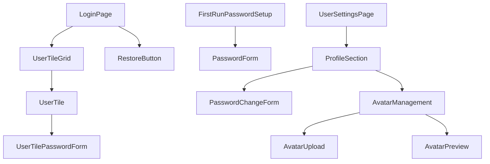

# Authentication Components

## Component Tree

### Hierarchy



### State Management

- Global state: NextAuth.js SessionProvider
- Local state: Form state for login and password management
- State flow: Login success updates global session state

## Individual Components

### UserTile

#### Purpose

- Displays a user tile in the login screen
- Handles both passwordless and password-protected login flows
- Displays user avatar or initials

#### Props Interface

```typescript
interface UserTileProps {
  /** User object with name and avatar information */
  user: {
    id: string;
    name: string;
    role: 'ADMIN' | 'USER';
    isActive: boolean;
    avatarUrl?: string;
  };
  /** Whether this user has a password set */
  hasPassword: boolean;
  /** Callback when user selects this tile */
  onSelect: (userId: string) => void;
  /** Whether this tile is currently selected */
  isSelected: boolean;
  /** Whether this is the first run (admin setup) */
  isFirstRun?: boolean;
}
```

#### Usage Example

```tsx
import { UserTile } from '@/components/auth';

const LoginScreen = () => {
  const [selectedUserId, setSelectedUserId] = useState<string | null>(null);
  
  return (
    <div className="user-tile-grid">
      {users.map(user => (
        <UserTile
          key={user.id}
          user={user}
          hasPassword={Boolean(user.passwordHash)}
          onSelect={(id) => setSelectedUserId(id)}
          isSelected={selectedUserId === user.id}
          isFirstRun={isFirstRunState}
        />
      ))}
    </div>
  );
};
```

#### State Management

- Internal state: expanded/collapsed state for password form
- State update patterns: onClick handlers toggle expanded state
- Side effects: Animation transitions when expanding/collapsing

### PasswordChangeForm

#### Purpose

- Allows users to change their password
- Validates password complexity requirements
- Provides feedback on success/failure

#### Props Interface

```typescript
interface PasswordChangeFormProps {
  /** Whether the user already has a password set */
  hasExistingPassword: boolean;
  /** Callback when password is successfully changed */
  onSuccess?: () => void;
  /** Callback when user cancels the form */
  onCancel?: () => void;
}
```

#### Usage Example

```tsx
import { PasswordChangeForm } from '@/components/auth';

const ProfilePage = () => {
  const { data: session } = useSession();
  const hasPassword = Boolean(session?.user?.hasPassword);
  
  return (
    <div>
      <h2>Change Password</h2>
      <PasswordChangeForm 
        hasExistingPassword={hasPassword}
        onSuccess={() => showSuccessMessage('Password updated successfully')}
      />
    </div>
  );
};
```

#### State Management

- Internal state: form values and validation state
- Error handling: Field-level and form-level validation with error messages

### AvatarManagement

#### Purpose

- Allows users to upload, preview, and remove profile avatars
- Generates initials fallback for users without avatars
- Provides drag-and-drop and file selection interfaces

#### Props Interface

```typescript
interface AvatarManagementProps {
  /** Current user avatar URL if exists */
  currentAvatarUrl?: string;
  /** User's name for generating initials */
  userName: string;
  /** Maximum file size in bytes (default: 1MB) */
  maxSize?: number;
  /** Callback when avatar is updated */
  onAvatarUpdate: (file: File | null) => Promise<void>;
}
```

#### Usage Example

```tsx
import { AvatarManagement } from '@/components/auth';

const ProfilePage = () => {
  const { data: session } = useSession();
  
  const handleAvatarUpdate = async (file: File | null) => {
    // Handle avatar update logic
  };
  
  return (
    <div>
      <h2>Profile Picture</h2>
      <AvatarManagement
        currentAvatarUrl={session?.user?.avatarUrl}
        userName={session?.user?.name || ''}
        onAvatarUpdate={handleAvatarUpdate}
      />
    </div>
  );
};
```

#### Accessibility

- ARIA roles: image role for avatar preview
- Keyboard navigation: Tab navigation for all interactive elements
- Screen reader support: Alt text for avatar images, labels for upload controls

## Shared Components

### Common Patterns

- Reusable patterns: Form validation with Zod schemas
- Best practices: Server-side validation mirrors client-side
- Anti-patterns to avoid: Storing sensitive auth data in localStorage

### Component Communication

- Event handling: Props for callbacks on success/failure
- Context usage: NextAuth SessionProvider for global auth state

## Performance Optimization

### Rendering

- Memoization strategy: React.memo for user tiles in grid
- Re-render prevention: Debounced form validation

### Data Loading

- Loading states: Skeleton loaders during auth operations
- Error states: Informative error messages for auth failures
- Caching strategy: Session data caching via NextAuth 
