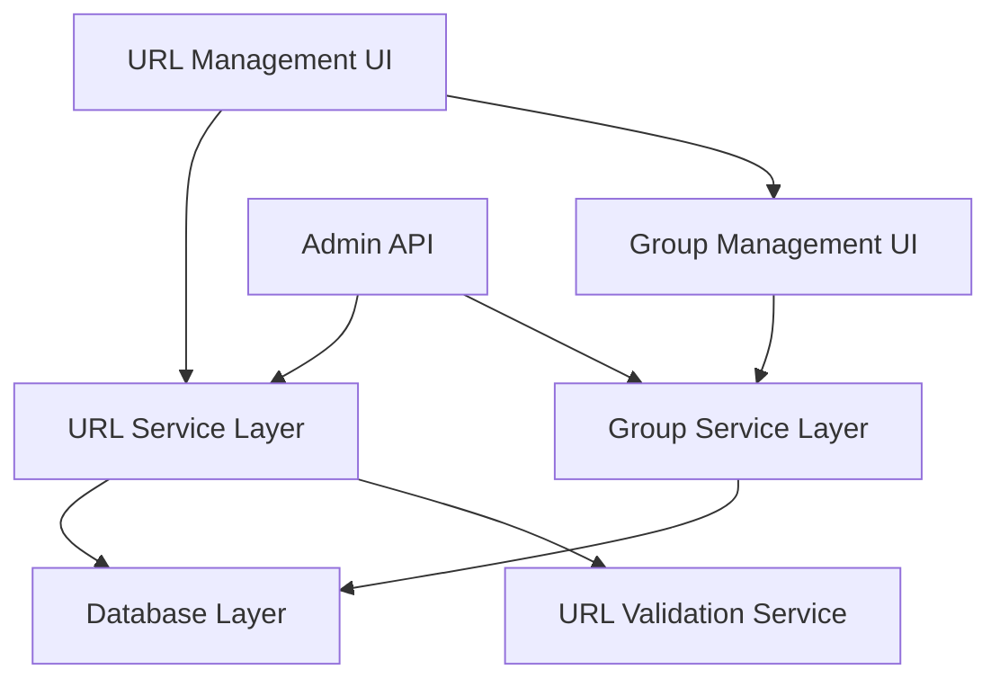
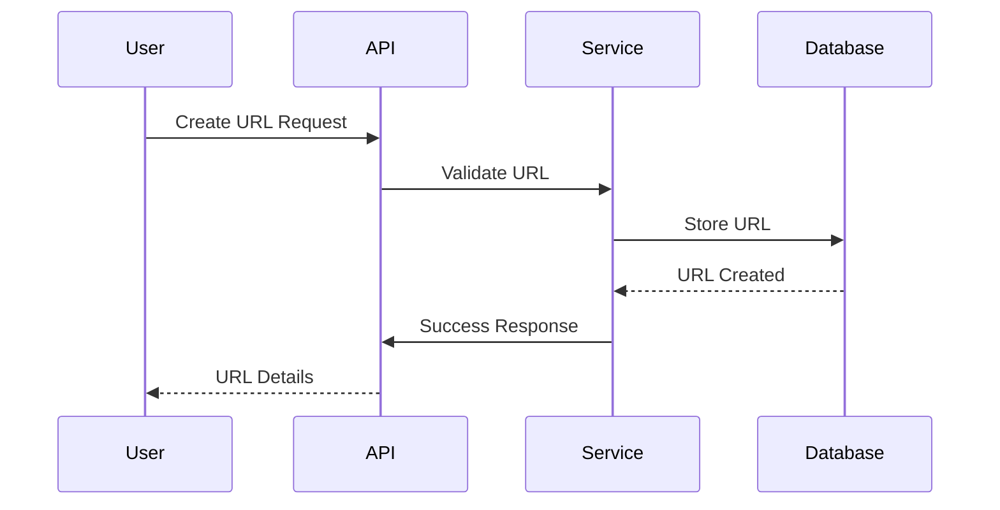
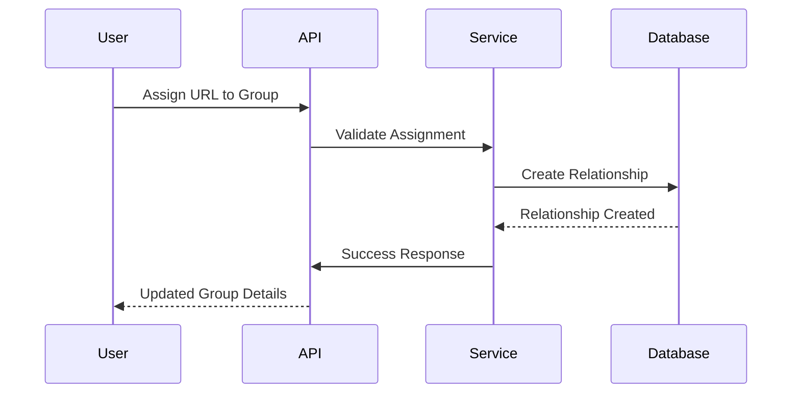

# URL Management Architecture

## System Architecture

### Component Overview

## Core Components

### 1. Data Layer
- **Prisma ORM**: Primary database interface
- **Models**: 
  - `Url`
  - `UrlGroup`
  - `UrlsInGroups`
  - `UserUrlGroup`
- **Indexes**: Optimized for group-based queries and ordering

### 2. Service Layer
- **URL Service**: Handles URL CRUD operations
- **Group Service**: Manages group operations
- **Relationship Service**: Handles URL-group relationships
- **Validation Service**: URL format and accessibility checks

### 3. API Layer
- **REST Endpoints**: Admin and user operations
- **GraphQL Schema**: (Future implementation)
- **Middleware**: Authentication and validation

### 4. UI Components
- **URL Management**: URL CRUD interface
- **Group Management**: Group organization interface
- **Batch Operations**: Bulk action interface
- **Order Management**: Display order interface

## Data Flow

### URL Creation Flow

### Group Assignment Flow

## State Management

### URL States
- **Unassigned**: URL exists but not in any group
- **Assigned**: URL belongs to one or more groups
- **Ordered**: URL has display order in group
- **Mobile Configured**: URL has mobile variant
- **External**: URL configured to open in a new browser tab instead of the iframe

### Group States
- **Empty**: Group with no URLs
- **Populated**: Group containing URLs
- **User Assigned**: Group associated with users

## Performance Considerations

### Database Optimization
- Indexed queries for group operations
- Efficient relationship management
- Batch operation support

### Caching Strategy
- URL metadata caching
- Group structure caching
- Display order caching

### Query Optimization
- Selective loading of relationships
- Pagination for large groups
- Efficient ordering updates

## Security Model

### Access Control
- Role-based access control
- Group-level permissions
- URL-level restrictions

### Data Validation
- URL format validation
- Group name uniqueness
- Display order constraints

### Error Handling
- Graceful failure handling
- Detailed error messages
- Transaction rollback support

## Scalability

### Horizontal Scaling
- Stateless service design
- Distributed caching support
- Load balancing ready

### Vertical Scaling
- Efficient database indexes
- Optimized query patterns
- Resource utilization monitoring

## Monitoring and Logging

### Metrics
- URL operation latency
- Group operation performance
- Error rates and types

### Logging
- Operation audit trail
- Error tracking
- Performance monitoring

## Future Enhancements

### Planned Features
- GraphQL API support
- Real-time updates
- Advanced search capabilities
- Drag-and-drop reordering

### Technical Debt
- Schema optimization
- Cache implementation
- Error handling refinement

## Integration Points

### External Systems
- Authentication service
- Monitoring systems
- Backup services

### Internal Systems
- User management
- Configuration service
- Notification system
