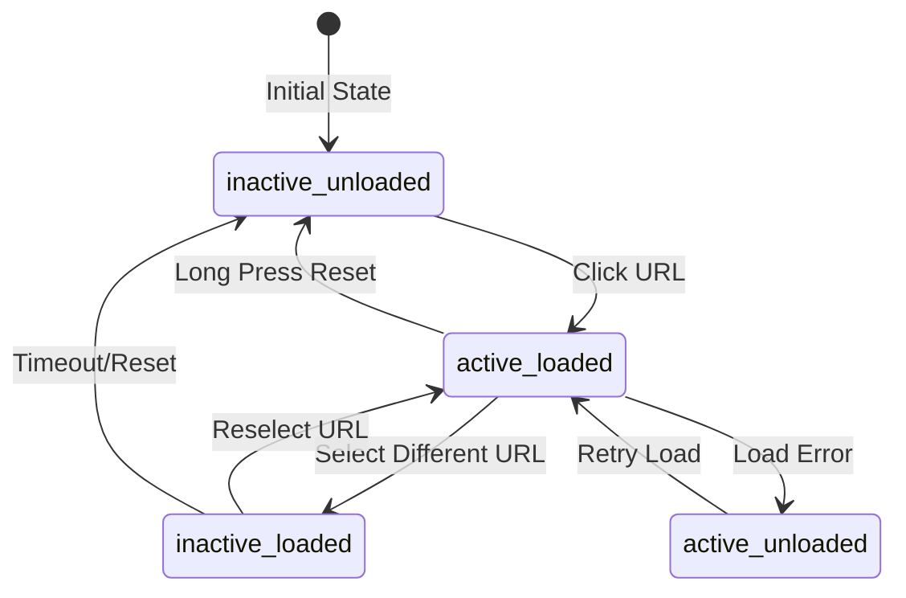
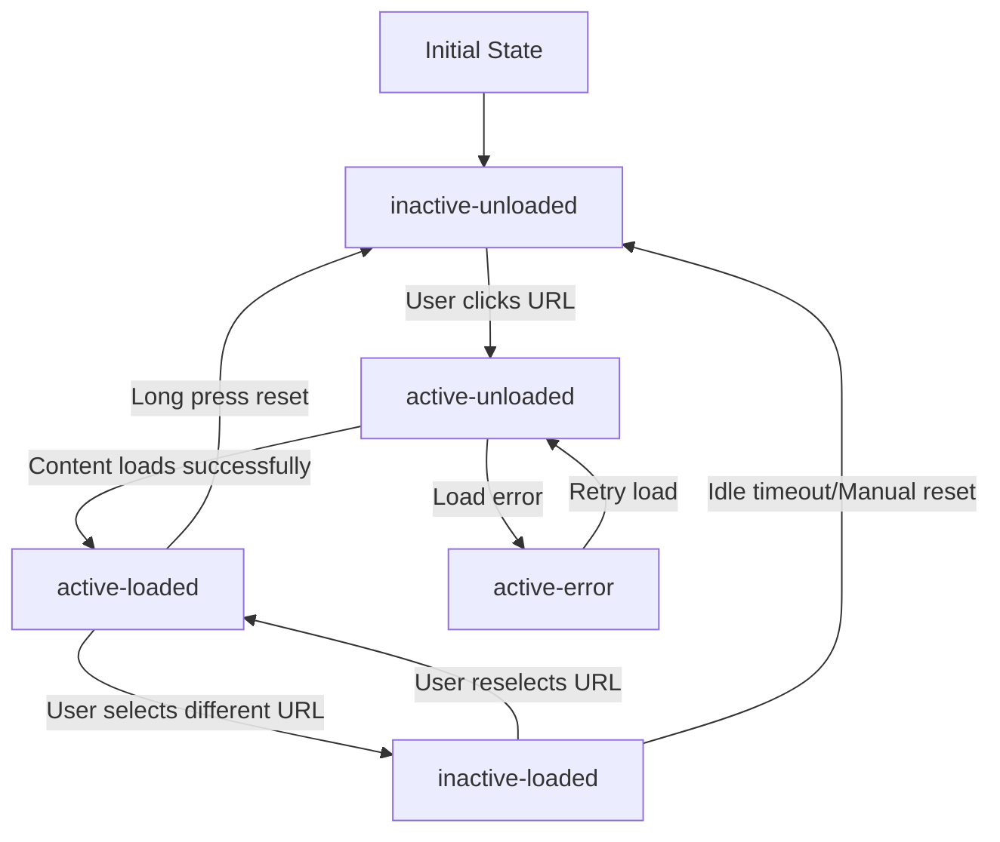

# URL Management & IFrame Container Architecture

## System Design

### Component Architecture
```
/app/
├── components/
│   ├── url/                  # URL management components
│   │   ├── menu/            # URL menu components
│   │   │   ├── group.tsx    # URL group component
│   │   │   └── item.tsx     # URL menu item
│   │   └── iframe/          # IFrame components
│   │       ├── container.tsx # IFrame container
│   │       └── overlay.tsx   # Loading/error overlay
│   └── common/              # Shared components
└── hooks/                   # Custom hooks
    ├── useIframeState.ts   # IFrame state management
    ├── useLongPress.ts     # Long press detection
    └── useUrlMenu.ts       # Menu state management
```

### State Management Flow


### Data Models

```typescript
interface UrlGroup {
  id: string;
  name: string;
  description?: string;
  display_order: number;
  created_at: Date;
  updated_at: Date;
}

interface Url {
  id: string;
  group_id: string;
  title: string;
  url: string;
  mobile_url?: string;
  icon_path?: string;
  display_order: number;
  idle_timeout?: number;
  created_at: Date;
  updated_at: Date;
}

interface IframeState {
  url: string;
  isLoaded: boolean;
  isVisible: boolean;
  error?: string;
  lastActive: Date;
}

interface MenuState {
  activeUrl: string | null;
  loadedUrls: Set<string>;
  expandedGroups: Set<string>;
}
```

## Technical Decisions

### IFrame State Management
- Custom React context for state
- Reducer pattern for actions
- URL-specific state tracking
- Efficient state updates
- Memory leak prevention

### IFrame Lifecycle Management
#### State Transition System
The iframe container implements a sophisticated state machine for managing iframe lifecycles:



#### Core Hooks System
The iframe lifecycle management relies on three specialized hooks that work together:

1. **useGlobalIframeContainer**
   - Creates a singleton DOM container outside React's render tree
   - Manages iframe DOM elements directly for performance
   - Handles iframe creation, removal, and visibility
   - Maintains wrapper elements for positioning and z-index management
   - Interface:
     ```typescript
     interface UseGlobalIframeContainerReturn {
       createIframe: (urlId: string, url: string) => HTMLIFrameElement;
       removeIframe: (urlId: string) => void;
       updateIframeVisibility: (urlId: string, isVisible: boolean) => void;
       updateContainerPosition: (rect: DOMRect) => void;
     }
     ```

2. **useIframeLifecycle**
   - Manages the loading, unloading, and resetting of iframes
   - Handles iframe events (load, error)
   - Updates state based on iframe lifecycle events
   - Provides methods for content manipulation
   - Interface:
     ```typescript
     interface UseIframeLifecycleReturn {
       loadIframe: (urlId: string, url: string) => void;
       unloadIframe: (urlId: string) => void;
       resetIframe: (urlId: string) => void;
     }
     ```

3. **useIframeVisibility**
   - Controls iframe visibility based on active state
   - Manages status transitions between active and inactive states
   - Preserves loaded/unloaded state during visibility changes
   - Interface:
     ```typescript
     interface UseIframeVisibilityReturn {
       showIframe: () => void;
       hideIframe: () => void;
     }
     ```

#### Lifecycle Events and Handlers
The iframe lifecycle includes several key events:

| Event | Handler | State Transition | Action |
|-------|---------|------------------|--------|
| URL Selection | `onUrlSelect` | inactive-unloaded → active-unloaded | Set iframe src, show iframe |
| Load Complete | `handleLoad` | active-unloaded → active-loaded | Update status, record activity |
| Load Error | `handleError` | active-unloaded → active-error | Set error state, display error message |
| URL Deselection | `onUrlDeselect` | active-loaded → inactive-loaded | Hide iframe but maintain content |
| Manual Reset | `resetIframe` | any → inactive-unloaded | Clear src, reset state |
| Idle Timeout | `handleIdleTimeout` | inactive-loaded → inactive-unloaded | Clear content after timeout |

#### Memory and Resource Management
The iframe lifecycle system includes several optimizations:

1. **Content Caching**
   - Inactive iframes preserve their content for quick reactivation
   - Loaded content is stored in memory until explicitly unloaded

2. **Resource Limits**
   - Configurable maximum number of cached iframes
   - Automatic unloading of least recently used iframes
   - Prioritization based on activity timestamps

3. **Error Recovery**
   - Automatic retry for transient errors
   - Manual reset capability
   - Error state preservation for diagnostics

4. **Event Cleanup**
   - Proper removal of event listeners
   - DOM element cleanup on unmount
   - Memory leak prevention

5. **Performance Optimizations**
   - Direct DOM manipulation outside React render cycles
   - Batch updates for state changes
   - Deferred loading for inactive URLs

### URL Menu Organization
- Collapsible group structure
- State-based rendering
- Efficient updates
- Mobile responsiveness
- Keyboard accessibility

### IFrame Loading Strategy
- Lazy loading by default
- State-based visibility
- Error boundary protection
- Resource cleanup
- Performance optimization

## Performance Considerations

### IFrame Management
```typescript
const iframeConfig = {
  // Memory management settings
  maxCachedFrames: 5,
  cleanupInterval: 300000, // 5 minutes
  
  // Loading settings
  loadTimeout: 30000,
  retryAttempts: 3,
  retryDelay: 1000,
  
  // Resource settings
  preloadThreshold: 2,
  unloadThreshold: 10
};
```

### State Updates
```typescript
// Batch update optimization
const batchedStateUpdate = (updates: Partial<IframeState>[]) => {
  return {
    type: 'BATCH_UPDATE',
    payload: updates
  };
};

// Selective re-rendering
const shouldComponentUpdate = (
  prevProps: IframeProps,
  nextProps: IframeProps
) => {
  return (
    prevProps.url !== nextProps.url ||
    prevProps.isVisible !== nextProps.isVisible ||
    prevProps.isLoaded !== nextProps.isLoaded
  );
};
```

## Error Handling

### IFrame Error Boundary
```typescript
class IframeErrorBoundary extends React.Component<
  PropsWithChildren<{
    onError: (error: Error) => void;
  }>
> {
  static getDerivedStateFromError(error: Error) {
    return { hasError: true, error };
  }

  componentDidCatch(error: Error, info: ErrorInfo) {
    this.props.onError(error);
    // Log error details
  }
}
```

### Error Recovery Strategy
1. Automatic retry for transient errors
2. Manual reset option via long press
3. Error state persistence
4. User feedback
5. Logging and monitoring

## State Synchronization

### URL Menu and IFrame Sync
```typescript
interface SyncState {
  activeUrl: string | null;
  loadedUrls: Set<string>;
  errors: Map<string, string>;
}

const syncManager = {
  // State updates
  updateMenuState: (state: Partial<SyncState>) => void;
  updateIframeState: (state: Partial<SyncState>) => void;
  
  // Event handlers
  onUrlActivated: (url: string) => void;
  onIframeLoaded: (url: string) => void;
  onIframeError: (url: string, error: string) => void;
  
  // Cleanup
  cleanup: () => void;
};
```

## Initialization Process

1. URL Group Setup
   - Load URL group configuration
   - Initialize menu state
   - Set up event listeners
   - Configure error boundaries

2. IFrame Container Setup
   - Initialize state management
   - Set up visibility tracking
   - Configure error handling
   - Initialize cleanup routines

3. State Management Setup
   - Create state context
   - Initialize reducers
   - Set up synchronization
   - Configure persistence

## Configuration Requirements

### Environment Variables
```env
MAX_CACHED_FRAMES=5
CLEANUP_INTERVAL=300000
LOAD_TIMEOUT=30000
RETRY_ATTEMPTS=3
PRELOAD_THRESHOLD=2
```

### Feature Flags
```typescript
const featureFlags = {
  enableDragAndDrop: false,
  enableAutoValidation: false,
  enableCrossOrigin: false,
  enableAutoMobileDetection: true
};
```

## Security Considerations

1. IFrame Security
   - Sandbox attributes
   - CSP configuration
   - Cross-origin handling
   - Script injection prevention

2. URL Validation
   - Input sanitization
   - Protocol validation
   - Domain whitelisting
   - XSS prevention

3. Resource Management
   - Memory limits
   - CPU usage monitoring
   - Network throttling
   - Error rate tracking

## Monitoring and Logging

### Metrics Collection
```typescript
interface IframeMetrics {
  loadTime: number;
  errorRate: number;
  memoryUsage: number;
  activeTime: number;
}

const metricsCollector = {
  trackLoadTime: (url: string, duration: number) => void;
  trackError: (url: string, error: string) => void;
  trackMemoryUsage: (usage: number) => void;
  trackActiveTime: (url: string, duration: number) => void;
};
```

### Performance Monitoring
1. Load time tracking
2. Error rate monitoring
3. Memory usage tracking
4. CPU utilization
5. Network requests 
