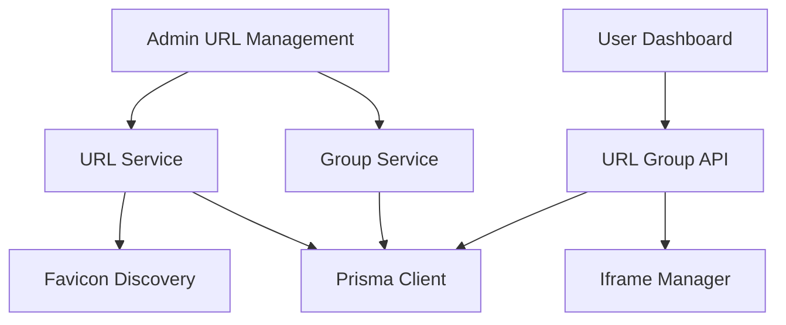

# URL Management Architecture

## System Design

### Overview

- The URL Management system provides a way to organize and access URLs through groups
- Global URLs are stored once but can be included in multiple groups with custom display settings
- Automatic favicon discovery attempts to find icons for URLs
- Admin interfaces provide CRUD operations for URLs and groups

### Component Relationships

```mermaid
graph TD
    A[Admin URL Management] --> B[URL Service]
    A --> C[Group Service]
    B --> D[Prisma Client]
    C --> D
    B --> E[Favicon Discovery]
    F[User Dashboard] --> G[URL Group API]
    G --> D
    G --> H[Iframe Manager]
```

### Data Flow

- Input handling: 
  - URL and group data validated via Zod before processing
  - File uploads for custom favicons processed through formidable
- Processing steps:
  - URLs created/updated at global level first
  - Group associations managed separately
  - Favicon discovery runs on URL creation/update
- Error handling paths:
  - Duplicate URL detection
  - Invalid URL format handling
  - Favicon discovery failures handled gracefully

## Technical Decisions

### Technology Choices

- Prisma ORM for data storage
  - Rationale: Type-safe database access, handles relationships well
  - Alternatives considered: Raw SQL, TypeORM
- React Context for URL state management
  - Approach: IframeProvider to track loaded/active URLs
  - Justification: Centralized state management without excessive prop drilling
- Zod for validation
  - Solution: Schema-based validation for URL and group data
  - Reasoning: Type safety, consistent validation on client and server

### Design Patterns

- Service Layer
  - Use case: Separates business logic from API routes
  - Implementation details: `urlService.js` and `groupService.js` in `/lib/services/`
- Repository Pattern
  - Use case: Database access abstraction
  - Implementation details: Prisma client encapsulated in service methods

### Performance Considerations

- Caching strategy: URLs and groups fetched once per session and stored in state
- Optimization techniques: Batch database operations using Prisma transactions
- Resource management: Efficient favicon handling to prevent excessive network requests

## Dependencies

### External Services

- Service: External websites (for favicon discovery)
  - Purpose: Discover favicon URLs
  - Fallback strategy: Use initials or default icon if favicon unavailable

### Internal Dependencies

- Module: Prisma ORM
  - Purpose: Database access for URL and group data
  - Integration points: URL, Group, and UrlInGroup models
  - Error handling: Prisma errors mapped to appropriate HTTP responses

### Configuration

- Environment variables: None specific to URL management
- Feature flags: None for MVP

## Security

### Authentication

- Method: NextAuth.js authentication required for all URL management APIs
- Implementation: API routes protected via middleware

### Authorization

- Access control: Admin role required for URL and group management
- Role management: User roles checked in API routes
- Permission checks: Admin-only routes for management functions

### Data Protection

- Data handling: URL data sanitized before storage
- Security considerations: XSS prevention in URL and title fields

## Monitoring

### Metrics

- Key performance indicators: URL creation success rate, favicon discovery success rate
- Health checks: URL service availability

### Logging

- Log levels: Error, warn, info
- Important events: URL creation, group creation, favicon discovery attempts
- Error tracking: Failed favicon discovery, database errors

## Deployment

### Requirements

- Infrastructure needs: File storage for custom favicons
- Dependencies: formidable for file uploads
- Configuration: File upload limits and allowed types

### Process

- Deployment steps: Standard Next.js deployment
- Health checks: URL creation verification post-deployment

## Future Considerations

- Scalability plans: Support for user-specific URL groups
- Technical debt: Improve favicon discovery reliability
- Improvement opportunities: Download and re-host discovered favicons rather than storing links 
