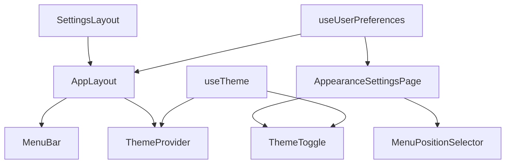

# User Settings & Preferences Components

## Overview

The User Settings & Preferences system consists of several key components that work together to provide a seamless user experience for managing application preferences. These components handle theme switching, menu positioning, and other user-specific settings.

## Core Components

### AppearanceSettingsPage

The main settings page for managing theme and menu position preferences.

```typescript
// app/settings/appearance/page.tsx
export default function AppearanceSettingsPage() {
  const { preferences, loading, updateMenuPosition, updateThemeMode } = useUserPreferences();
  const themeContext = useContext(ThemeContext);

  // Component interface
  interface AppearanceSettingsProps {
    // No props required - uses hooks for state management
  }

  // Key features
  // - Theme switching with visual preview
  // - Menu position selection with layout preview
  // - Real-time updates
  // - Error handling with notifications
  // - Loading states
}
```

### SettingsLayout

Layout component for the settings area with forced side menu.

```typescript
// app/settings/layout.tsx
interface SettingsLayoutProps {
  children: ReactNode;
}

export default function SettingsLayout({ children }: SettingsLayoutProps) {
  // Forces side menu regardless of user preference
  return (
    <AppLayout menuContent={<SettingsSidebar />} forceMenuPosition="side">
      {/* Layout structure */}
    </AppLayout>
  );
}
```

### AppLayout

Main application layout with dynamic menu positioning.

```typescript
// app/components/layout/AppLayout.tsx
interface AppLayoutProps {
  children: ReactNode;
  menuContent: ReactNode;
  forceMenuPosition?: 'side' | 'top' | null;
}

export default function AppLayout(props: AppLayoutProps) {
  const { preferences } = useUserPreferences();
  
  // Features
  // - Dynamic menu positioning
  // - Mobile responsiveness
  // - Theme integration
  // - User menu with settings access
}
```

### MenuBar

Adaptive menu component that responds to position preferences.

```typescript
// app/components/ui/MenuBar.tsx
interface MenuBarProps {
  urlGroups: UrlGroup[];
  activeUrlId: string | null;
  loadedUrlIds?: string[];
  onUrlClick: (url: Url) => void;
  menuPosition?: 'side' | 'top';
}

export default function MenuBar(props: MenuBarProps) {
  // Features
  // - Adaptive layout based on position
  // - Mobile-first design
  // - Collapsible groups
  // - Active state indicators
}
```

## Custom Hooks

### useUserPreferences

Core hook for managing user preferences.

```typescript
// app/lib/hooks/useUserPreferences.ts
interface UseUserPreferencesReturn {
  preferences: UserPreferences;
  loading: boolean;
  error: string | null;
  updateMenuPosition: (position: 'side' | 'top') => Promise<void>;
  updateThemeMode: (mode: 'light' | 'dark') => Promise<void>;
}

export function useUserPreferences(): UseUserPreferencesReturn {
  // Features
  // - Preference state management
  // - API integration
  // - Caching
  // - Error handling
  // - Optimistic updates
}
```

### useTheme

Hook for theme management and system theme detection.

```typescript
// app/lib/hooks/useTheme.ts
interface UseThemeReturn {
  theme: Theme;
  toggleTheme: () => void;
  setTheme: (theme: 'light' | 'dark') => void;
}

export function useTheme(): UseThemeReturn {
  // Features
  // - Theme state management
  // - System theme detection
  // - Theme persistence
  // - Real-time updates
}
```

## Utility Components

### ThemeToggle

Component for switching between light and dark themes.

```typescript
// app/components/ui/ThemeToggle.tsx
interface ThemeToggleProps {
  size?: 'small' | 'medium' | 'large';
  showLabel?: boolean;
}

export function ThemeToggle(props: ThemeToggleProps) {
  const { theme, toggleTheme } = useTheme();
  
  // Features
  // - Visual theme indicator
  // - Accessible button
  // - Optional label
  // - Size variants
}
```

### MenuPositionSelector

Component for selecting menu position preference.

```typescript
// app/components/ui/MenuPositionSelector.tsx
interface MenuPositionSelectorProps {
  value: 'side' | 'top';
  onChange: (position: 'side' | 'top') => void;
  disabled?: boolean;
}

export function MenuPositionSelector(props: MenuPositionSelectorProps) {
  // Features
  // - Visual position preview
  // - Interactive selection
  // - Disabled state
  // - Animation feedback
}
```

## Component Relationships



## Usage Examples

### Theme Management

```typescript
function ThemeExample() {
  const { theme, toggleTheme } = useTheme();
  
  return (
    <Box sx={{ bgcolor: 'background.default', color: 'text.primary' }}>
      <ThemeToggle size="medium" showLabel />
      <Typography>Current theme: {theme.palette.mode}</Typography>
    </Box>
  );
}
```

### Menu Position

```typescript
function MenuExample() {
  const { preferences, updateMenuPosition } = useUserPreferences();
  
  return (
    <MenuPositionSelector
      value={preferences.menuPosition}
      onChange={updateMenuPosition}
    />
  );
}
```

## Testing Considerations

### Component Testing

```typescript
describe('AppearanceSettingsPage', () => {
  it('renders theme options', () => {
    render(<AppearanceSettingsPage />);
    expect(screen.getByText('Theme')).toBeInTheDocument();
  });

  it('updates theme preference', async () => {
    const { user } = render(<AppearanceSettingsPage />);
    await user.click(screen.getByLabelText('Dark Theme'));
    expect(screen.getByText('Dark Mode')).toBeInTheDocument();
  });
});
```

### Hook Testing

```typescript
describe('useUserPreferences', () => {
  it('provides default preferences', () => {
    const { result } = renderHook(() => useUserPreferences());
    expect(result.current.preferences).toEqual({
      menuPosition: 'side',
      themeMode: 'light'
    });
  });

  it('updates preferences', async () => {
    const { result } = renderHook(() => useUserPreferences());
    await act(() => result.current.updateMenuPosition('top'));
    expect(result.current.preferences.menuPosition).toBe('top');
  });
});
```

### Integration Testing

```typescript
describe('Settings Integration', () => {
  it('persists preferences across sessions', async () => {
    // Setup
    render(<AppearanceSettingsPage />);
    
    // Update preference
    await userEvent.click(screen.getByLabelText('Dark Theme'));
    
    // Verify persistence
    await waitFor(() => {
      expect(localStorage.getItem('theme')).toBe('dark');
    });
    
    // Verify after reload
    window.location.reload();
    expect(screen.getByLabelText('Dark Theme')).toBeChecked();
  });
});
```

### E2E Testing

```typescript
test('complete settings workflow', async ({ page }) => {
  // Navigate to settings
  await page.goto('/settings/appearance');
  
  // Update theme
  await page.click('[aria-label="Dark Theme"]');
  await expect(page.locator('body')).toHaveClass(/dark/);
  
  // Update menu position
  await page.click('[aria-label="Top Menu"]');
  await expect(page.locator('#main-menu')).toHaveClass(/top/);
  
  // Verify persistence
  await page.reload();
  await expect(page.locator('body')).toHaveClass(/dark/);
  await expect(page.locator('#main-menu')).toHaveClass(/top/);
}); 
