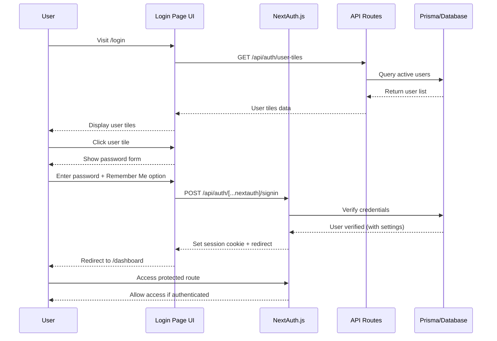
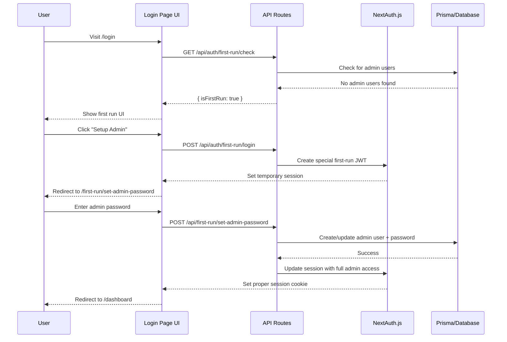

# Authentication Flow Documentation

## Standard Authentication Flow

## First Run Flow

## Authentication Components

### NextAuth.js Configuration

- **Providers**: Credentials provider for username/password authentication
- **Callbacks**:
  - `jwt`: Includes user data and preferences in JWT payload
  - `session`: Exposes user data and preferences to client
  - `authorize`: Verifies credentials against database
- **Session Strategy**: JWT with HTTP-only cookies
- **Pages**: Custom login page at `/login`

### Database Schema

- **User Model**:
  - `id`: Unique identifier (UUID)
  - `name`: Username
  - `isAdmin`: Boolean flag for admin privileges
  - `isActive`: Boolean flag for account status
  - `password`: Bcrypt hashed password
  - `lastLoginAt`: Timestamp of last successful login
  - `createdAt`: Account creation timestamp
  - `updatedAt`: Account update timestamp
  
- **UserSetting Model**:
  - `userId`: Foreign key to User (also primary key)
  - `theme`: User theme preference (LIGHT, DARK, SYSTEM)
  - `menuPosition`: UI preference (TOP, SIDE)

### API Endpoints

- **`/api/auth/[...nextauth]`**: NextAuth.js endpoints for authentication
- **`/api/auth/user-tiles`**: Returns list of users for login tiles
- **`/api/auth/first-run/check`**: Checks if system is in first-run state
- **`/api/auth/first-run/login`**: Special endpoint for passwordless first-run login
- **`/api/first-run/set-admin-password`**: Sets password for admin during first run

### Environment Variables

- `NEXTAUTH_SECRET`: Secret for JWT token signing
- `NEXTAUTH_URL`: Base URL for callbacks
- `NEXTAUTH_SESSION_MAX_AGE_SECONDS`: Default session duration
- `NEXTAUTH_REMEMBER_ME_MAX_AGE_SECONDS`: Extended session duration for "Remember Me"
- `DATABASE_URL`: Connection string for SQLite database

## Security Considerations

1. **Password Security**:
   - Passwords are hashed using bcrypt
   - Password validation enforces minimum complexity
   - No password recovery in current version

2. **Session Security**:
   - JWT tokens stored in HTTP-only cookies
   - Session includes minimal user data
   - Session invalidation on user status change
   - CSRF protection enabled

3. **First Run Security**:
   - Special first-run mode only active when no admin users exist
   - Temporary session limited to password setup only
   - System transitions to normal mode after admin setup 
