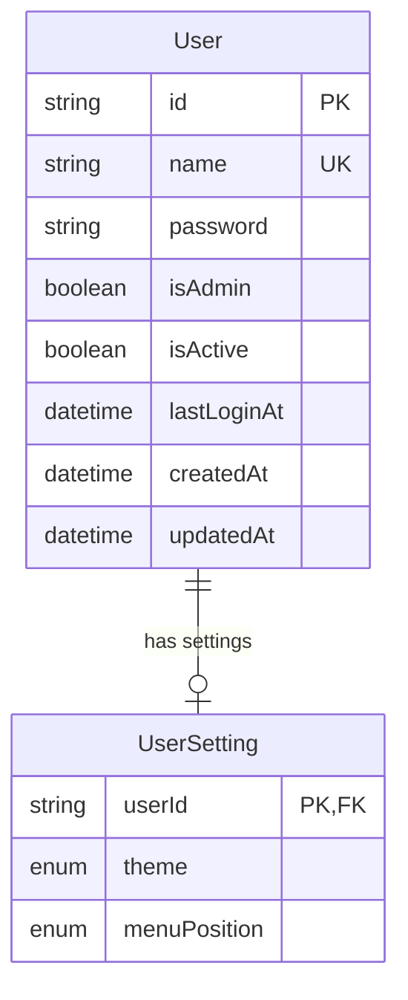

# Database Schema Documentation

## Overview

The application uses Prisma ORM with SQLite for data storage. This document details the core models defined in the Prisma schema, their relationships, and important constraints.

## Models

### User

The User model represents system users and their authentication details.

```prisma
model User {
  id          String       @id @default(uuid())
  name        String       @unique
  password    String
  isAdmin     Boolean      @default(false)
  isActive    Boolean      @default(true)
  lastLoginAt DateTime?
  createdAt   DateTime     @default(now())
  updatedAt   DateTime     @updatedAt
  settings    UserSetting?
}
```

#### Fields

| Field | Type | Description | Constraints |
|-------|------|-------------|------------|
| id | String | Unique identifier | @id, @default(uuid()) |
| name | String | Username | @unique |
| password | String | Bcrypt hashed password | Required |
| isAdmin | Boolean | Administrator privileges | @default(false) |
| isActive | Boolean | Account status | @default(true) |
| lastLoginAt | DateTime? | Time of last successful login | Optional |
| createdAt | DateTime | Account creation timestamp | @default(now()) |
| updatedAt | DateTime | Account update timestamp | @updatedAt |

#### Relationships

- One-to-one relationship with UserSetting

### UserSetting

The UserSetting model stores user preferences and UI settings.

```prisma
model UserSetting {
  userId       String      @id
  theme        Theme       @default(SYSTEM)
  menuPosition MenuPosition @default(SIDE)
  user         User        @relation(fields: [userId], references: [id], onDelete: Cascade)
}
```

#### Fields

| Field | Type | Description | Constraints |
|-------|------|-------------|------------|
| userId | String | Foreign key to User | @id |
| theme | Theme | UI theme preference | @default(SYSTEM) |
| menuPosition | MenuPosition | Menu position preference | @default(SIDE) |

#### Relationships

- Belongs to a User through userId field
- Configured with onDelete: Cascade to ensure it is deleted when the associated User is deleted

### Enums

```prisma
enum Theme {
  LIGHT
  DARK
  SYSTEM
}

enum MenuPosition {
  TOP
  SIDE
}
```

## Entity Relationship Diagram



## Database Migrations

### Initial Migration

The initial migration (20250528012127_init) creates the database structure with:

- User table with all required fields
- UserSetting table with foreign key relationship
- Proper indexes for unique constraints
- Referential actions (onDelete: Cascade)

## Implementation Notes

### User Creation

When creating a User, the application should:

1. Generate a UUID for the user ID
2. Hash the password using bcrypt
3. Set default values for isAdmin and isActive
4. Create a corresponding UserSetting record in the same transaction

Example:

```typescript
// Create user with settings in a transaction
const newUser = await prisma.$transaction(async (tx) => {
  const user = await tx.user.create({
    data: {
      name: "username",
      password: hashedPassword,
      isAdmin: false,
      settings: {
        create: {} // Uses default values
      }
    },
    include: {
      settings: true
    }
  });
  
  return user;
});
```

### Password Handling

Passwords should:

1. Never be stored in plain text
2. Be hashed using bcrypt with appropriate salt rounds
3. Be validated for complexity before hashing
4. Not be exposed in API responses

### Data Access Patterns

1. Always include necessary related data when fetching User records
2. Use transactions for operations that modify multiple tables
3. Verify referential integrity when updating related records
4. Handle non-existent relationships appropriately

## Security Considerations

1. User passwords are hashed and never stored as plain text
2. Unique constraints prevent duplicate usernames
3. isActive flag allows disabling users without deletion
4. Cascading deletes ensure no orphaned UserSetting records

## Future Considerations

1. Add email field to User model for notifications
2. Implement password reset functionality
3. Add user profile data model
4. Consider adding soft delete functionality
5. Add audit trail for security-sensitive operations 
